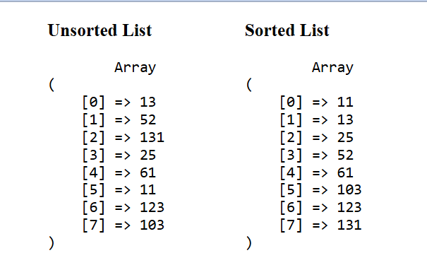

# PhPStudies

General repository for learning php

#### 13.02.2025 - Collecting data with Fetch api

<a href="./myCodes/fetch-api/fetch-01/index-2.html">File: </a> myCodes -> fetch-api -> fetch01 -> index-2.html
 

#### 14.04.2025 - Linear sort example

<a href="./myCodes/algorithms/linearsort.php">Linear Sort File
</a>
  

