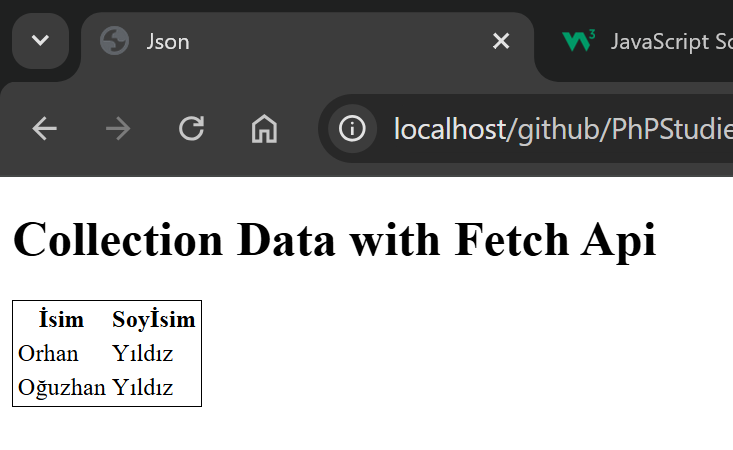

# PhPStudies
General repository for learning php

### 13.02.2025
#### Collection data with Fetch api
<a href="./myCodes/fetch-api/fetch-01/index-2.html">File: </a> myCodes -> fetch-api -> fetch01 -> index-2.html 

