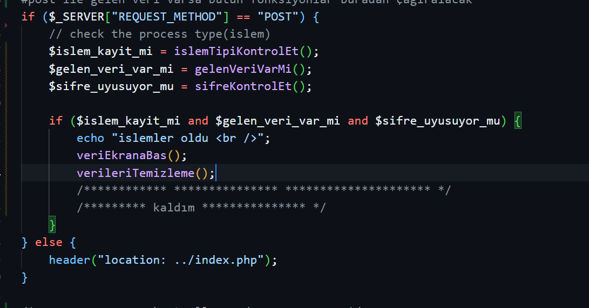

<h1>Login Ekranı</h1>
<h2>Yapılanlar</h2>

Login ekranından kullanıcı verilerini alıp, kaydet.php dosyasına gönderirir

Gelen veriler var mı ve boş değil mi diye kontrol eder. Değilse, login ekranına dönüp alert mesajı verir

<h2>Yapılacaklar</h2>
<h3>Kalıdığım yer:<h3>

02-05-2023 son 5 dakika kaldı

Hata mesajı liste şeklinde kullanıcacak

<h2>Yapılanlar 19 Mart</h2>

hata kodlarnını liste olarak ayarladık

<h2></h2>

dosya yazma işlemi yapıldı

25. dakikada kalındı

<h2>25 mart</h2>

Resim yükleme 1

<h2>Fonksiyonlar ile çalışma</h2>

<strong>LoginPage02: </strong>Bu versiyon fonksiyonlar ile yazılacak

<h4>Kaldığım yer</h4>

Artık fonksiyonlar yazarak devam edilecek

Her fonksiyon için de bir test yazılacak

<h4>Yapılanlar </h4>

Fonksiyonlar yazıldı, en son trim, strip_tags fonksiyonları yazıldı

<h4>Refactoring</h4>

Kod, guard metoduna göre yeniden yazılacak

